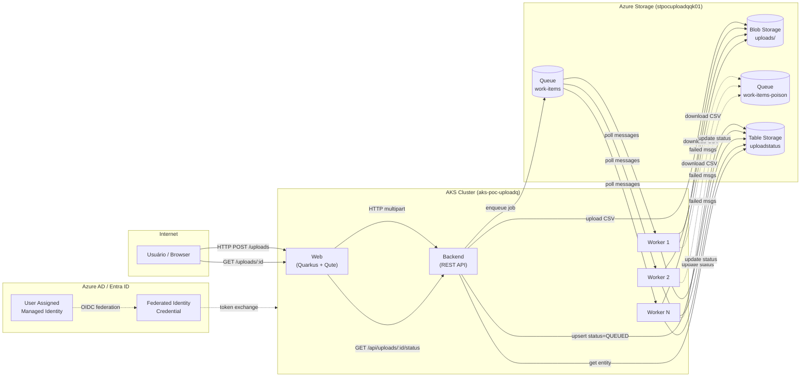
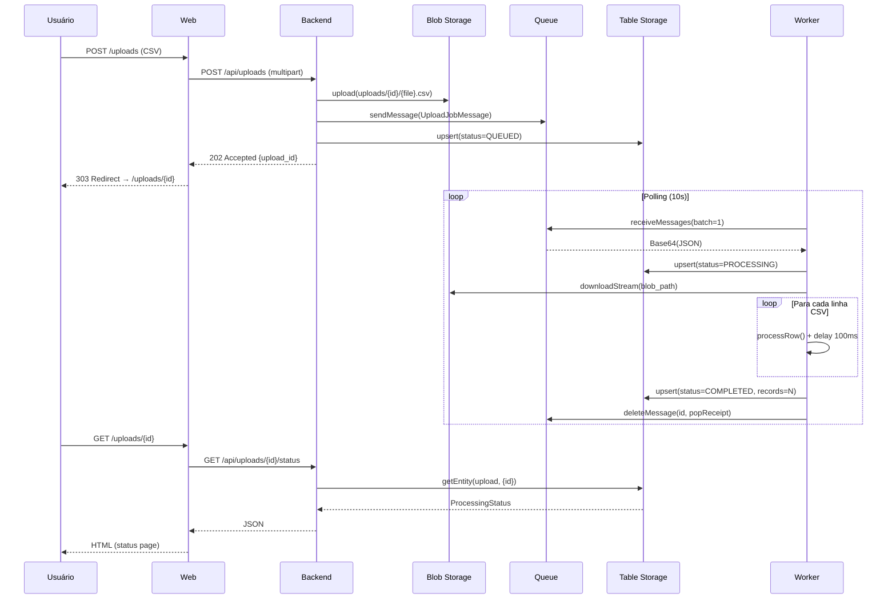
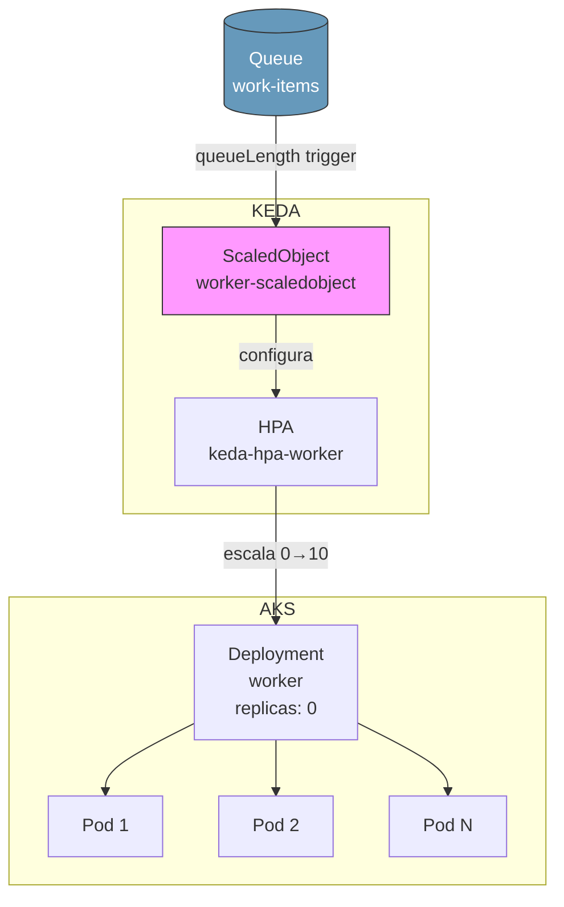
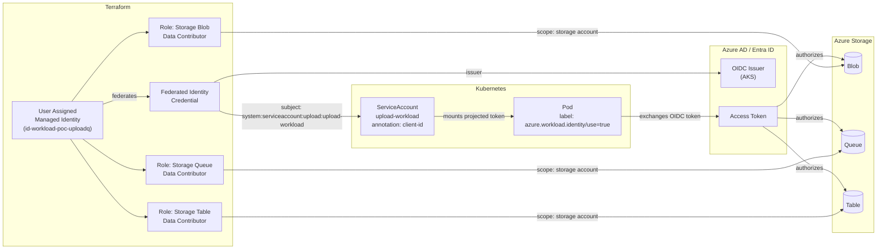
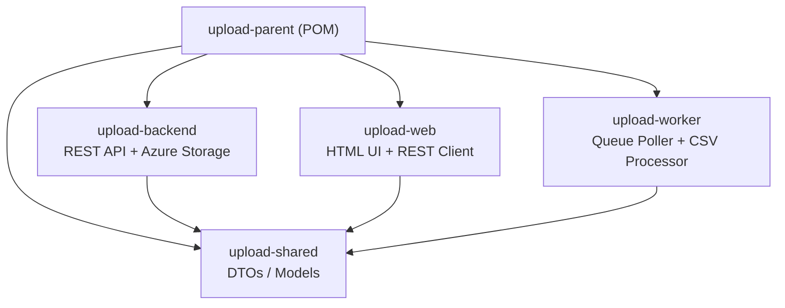

# Upload Quarkus PoC — Documentação de Arquitetura

## 1. Visão Geral da Arquitetura



## 2. Fluxo de Processamento



## 3. KEDA Autoscaling



**Parâmetros KEDA:**
- `pollingInterval`: 15s
- `cooldownPeriod`: 300s (5min)
- `minReplicaCount`: 0
- `maxReplicaCount`: 10
- `queueLength`: 1 (1 worker por mensagem na fila)

## 4. Cadeia de Identidade (Workload Identity)



## 5. Identidades e RBAC

### 5.1 Managed Identities

| Identidade | Tipo | Finalidade |
|---|---|---|
| AKS System Assigned | System Assigned | Identidade do cluster AKS para gerenciar recursos (nós, rede) |
| AKS Kubelet Identity | System Assigned | Usada pelos nós para pull de imagens do ACR |
| `id-workload-poc-uploadq` | User Assigned | Identidade dos pods para acessar Azure Storage |

### 5.2 Federated Identity Credential

| Campo | Valor |
|---|---|
| **Name** | `fic-workload-poc-uploadq` |
| **Parent** | `id-workload-poc-uploadq` (User Assigned MI) |
| **Issuer** | OIDC Issuer URL do AKS |
| **Subject** | `system:serviceaccount:upload:upload-workload` |
| **Audience** | `api://AzureADTokenExchange` |

### 5.3 Role Assignments (RBAC)

| Role | Scope | Principal | Motivo |
|---|---|---|---|
| `AcrPull` | Container Registry | AKS Kubelet Identity | Pull de imagens Docker |
| `Storage Blob Data Contributor` | Storage Account | `id-workload-poc-uploadq` | Upload/download de CSVs |
| `Storage Queue Data Contributor` | Storage Account | `id-workload-poc-uploadq` | Enviar/receber/deletar mensagens |
| `Storage Table Data Contributor` | Storage Account | `id-workload-poc-uploadq` | CRUD de status na tabela |

### 5.4 Kubernetes ServiceAccount

```yaml
apiVersion: v1
kind: ServiceAccount
metadata:
  name: upload-workload
  namespace: upload
  annotations:
    azure.workload.identity/client-id: "${WORKLOAD_IDENTITY_CLIENT_ID}"
  labels:
    azure.workload.identity/use: "true"
```

O label `azure.workload.identity/use: "true"` nos Pods faz com que o mutating webhook do Workload Identity injete:
- Volume com token OIDC projetado
- Variáveis de ambiente: `AZURE_CLIENT_ID`, `AZURE_TENANT_ID`, `AZURE_FEDERATED_TOKEN_FILE`

## 6. Acesso ao Azure Storage via Java/Quarkus

### 6.1 Blob Storage

```java
// Backend — BlobStorageService.java
@ApplicationScoped
public class BlobStorageService {
    private final BlobContainerClient containerClient;

    public BlobStorageService(
            @ConfigProperty(name = "upload.storage.blob-service-url") String blobServiceUrl,
            @ConfigProperty(name = "upload.storage.uploads-container-name") String containerName) {
        this.containerClient = new BlobServiceClientBuilder()
                .endpoint(blobServiceUrl)                          // https://stpocuploadqqk01.blob.core.windows.net
                .credential(new DefaultAzureCredentialBuilder().build()) // Workload Identity → OIDC → Token
                .buildClient()
                .getBlobContainerClient(containerName);            // "uploads"
    }

    public void upload(String blobPath, InputStream data, long length, String contentType) {
        containerClient.getBlobClient(blobPath).upload(data, length, false);
        containerClient.getBlobClient(blobPath)
                .setHttpHeaders(new BlobHttpHeaders().setContentType(contentType));
    }
}
```

**Fluxo de autenticação:**
1. `DefaultAzureCredentialBuilder().build()` tenta múltiplas credenciais em cadeia
2. No AKS com Workload Identity, usa `WorkloadIdentityCredential`
3. Lê o token OIDC do arquivo montado (`AZURE_FEDERATED_TOKEN_FILE`)
4. Troca o token OIDC por um Access Token do Azure AD
5. Usa o Access Token para autenticar chamadas ao Blob Storage
6. O role `Storage Blob Data Contributor` autoriza as operações

### 6.2 Queue Storage

```java
// Backend — QueueStorageService.java
@ApplicationScoped
public class QueueStorageService {
    private final QueueClient queueClient;
    private final ObjectMapper objectMapper;

    public QueueStorageService(
            @ConfigProperty(name = "upload.storage.queue-service-url") String queueServiceUrl,
            @ConfigProperty(name = "upload.storage.work-queue-name") String queueName,
            ObjectMapper objectMapper) {
        this.queueClient = new QueueClientBuilder()
                .endpoint(queueServiceUrl)                              // https://stpocuploadqqk01.queue.core.windows.net
                .queueName(queueName)                                   // "work-items"
                .credential(new DefaultAzureCredentialBuilder().build()) // Workload Identity
                .buildClient();
        this.objectMapper = objectMapper;
    }

    public void enqueue(UploadJobMessage message) {
        String json = objectMapper.writeValueAsString(message);
        String encoded = Base64.getEncoder().encodeToString(json.getBytes());
        queueClient.sendMessage(encoded);                               // Base64-encoded JSON
    }
}
```

```java
// Worker — QueueService.java
@ApplicationScoped
public class QueueService {
    private final QueueClient workQueue;
    private final QueueClient poisonQueue;

    public QueueService(...) {
        var credential = new DefaultAzureCredentialBuilder().build();    // Reutiliza instância
        this.workQueue = new QueueClientBuilder()
                .endpoint(queueServiceUrl).queueName(workQueueName)
                .credential(credential).buildClient();
        this.poisonQueue = new QueueClientBuilder()
                .endpoint(queueServiceUrl).queueName(poisonQueueName)
                .credential(credential).buildClient();                  // Mesma credencial, outra fila
    }

    public List<ReceivedMessage> receive(int batchSize) {
        return workQueue.receiveMessages(batchSize, Duration.ofSeconds(visibilityTimeout), null, null)
                .stream()
                .map(msg -> {
                    String decoded = new String(Base64.getDecoder().decode(msg.getBody().toString()));
                    var parsed = objectMapper.readValue(decoded, UploadJobMessage.class);
                    return new ReceivedMessage(msg, parsed);
                }).toList();
    }

    public void delete(QueueMessageItem msg) {
        workQueue.deleteMessage(msg.getMessageId(), msg.getPopReceipt());
    }
}
```

**Fluxo de autenticação:**
1. Mesmo mecanismo do Blob: `DefaultAzureCredential` → `WorkloadIdentityCredential`
2. Mensagens codificadas em Base64 (requisito do Azure Queue Storage)
3. `visibilityTimeout` de 3600s garante que mensagens não são reprocessadas
4. O role `Storage Queue Data Contributor` autoriza send/receive/delete/peek

### 6.3 Table Storage

```java
// Backend e Worker — StatusRepository.java
@ApplicationScoped
public class StatusRepository {
    private static final String PARTITION_KEY = "upload";
    private final TableClient tableClient;

    public StatusRepository(
            @ConfigProperty(name = "upload.storage.table-service-url") String tableServiceUrl,
            @ConfigProperty(name = "upload.storage.status-table-name") String tableName) {
        this.tableClient = new TableClientBuilder()
                .endpoint(tableServiceUrl)                              // https://stpocuploadqqk01.table.core.windows.net
                .tableName(tableName)                                   // "uploadstatus"
                .credential(new DefaultAzureCredentialBuilder().build()) // Workload Identity
                .buildClient();
    }

    public void upsert(ProcessingStatus status) {
        var entity = new TableEntity(PARTITION_KEY, status.getUploadId());
        entity.addProperty("state", status.getState());
        // ... demais propriedades
        tableClient.upsertEntity(entity);                               // Create or Update
    }
}
```

**Fluxo de autenticação:** idêntico aos demais — `DefaultAzureCredential` com role `Storage Table Data Contributor`.

### 6.4 Dependências Maven (Azure SDK)

```xml
<!-- pom.xml pai -->
<azure-sdk.version>1.2.29</azure-sdk.version>
<azure-identity.version>1.14.2</azure-identity.version>
<azure-storage-blob.version>12.29.0</azure-storage-blob.version>
<azure-storage-queue.version>12.23.0</azure-storage-queue.version>
<azure-data-tables.version>12.5.0</azure-data-tables.version>
```

## 7. Estrutura de Módulos


